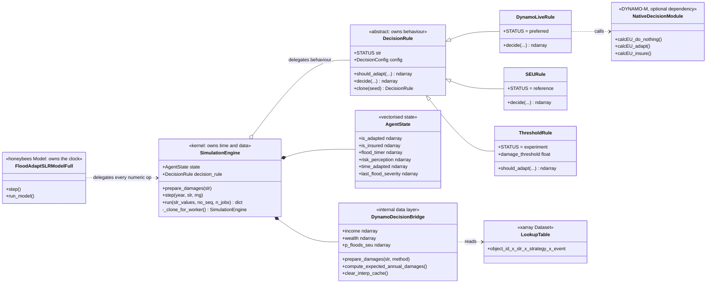
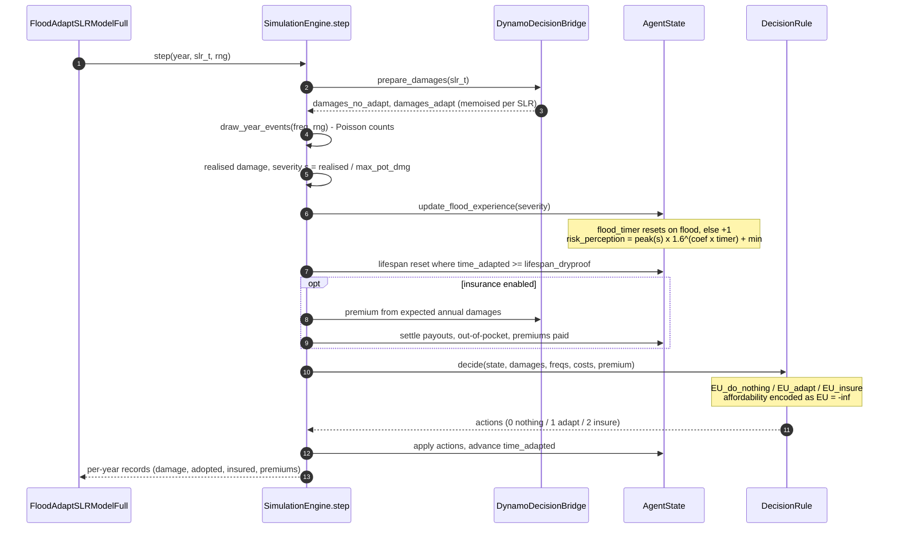

# FloodAdapt-ABM x DYNAMO-M: architecture and model description

**What this document is.** The design record for the coupled model as it is
implemented today. It answers *why and how the system is built*, and it
specifies the agent-based model precisely enough to reproduce or review it.

**What it is not.** It is not a user manual and not a project history. For the
API, see [`../floodadapt_abm_documentation.md`](../floodadapt_abm_documentation.md)
(the reference manual). For calibration and validation method, see
[`calibration_validation_guide.md`](calibration_validation_guide.md) (the method
guide). Development history lives in the git log and in the local
`docs/progress/` folder, not here.

**Audience.** Developers extending the model, and reviewers checking the
science.

**How it is organised.** Part I is the software architecture: components,
contracts, execution paths. Part II describes the model itself, following the
**ODD protocol** (Overview, Design concepts, Details), the standard structure
for describing agent-based models in the scientific literature. Part III covers
verification and validation. The appendices hold the glossary, the deviations
from native DYNAMO-M, and worked-example pointers.

---

# Part I. Software architecture

## 1. Purpose and system context

**Research question.** How do policy incentives and lived flood experience
shape household-level adaptation, and therefore the flood risk a coastal city
carries under sea-level rise?

Two repositories collaborate to answer it:

| Repository | Role | Key sources |
|---|---|---|
| **FloodAdapt-ABM** (this repo) | Owns time, data and bookkeeping. Turns a precomputed impact table into Monte-Carlo time series of damages and household decisions. | `simulation_engine.py`, `decision_rule.py`, `mesa_native_full.py` |
| **DYNAMO-M** (upstream, optional at runtime) | Supplies the Subjective Expected Utility (SEU) decision science. | `decision_module.py`, `agents/coastal_nodes.py`, `hazards/flooding/flood_risk.py`, `settings.yml` |

### 1.1 The two-stage pipeline

The system is deliberately split into two stages joined by **one file format**.
Stage 1 is expensive and runs rarely; stage 2 is cheap and runs many times.

```
Stage 1 (offline, hours)                    Stage 2 (online, seconds to minutes)
+-------------------------------+           +-----------------------------------+
| FloodAdapt: SFINCS + FIAT     |           | floodadapt_abm                    |
| over event x SLR x strategy   |  --.nc--> | Monte-Carlo ABM over years        |
| setup_lookup_table.py         |           | SimulationEngine + DecisionRule   |
+-------------------------------+           +-----------------------------------+
     needs flood-adapt                          pure NumPy / SciPy / xarray
```

**Why the split.** Hydrodynamic and damage modelling is far too slow to run
inside an agent decision loop. Precomputing the full grid of outcomes turns
per-year damage evaluation into an array lookup plus a one-dimensional
interpolation, which is what makes tens of thousands of Monte-Carlo sequences
feasible. The cost is that the ABM can only ask questions the grid already
answers.

### 1.2 The coupling contract

The `.nc` lookup table is the **only** interface between the stages. Keep it
stable.

| Element | Content |
|---|---|
| Dimensions | `object_id x slr x strategy x event` |
| Data variables | `total_damage`, `inun_depth` |
| `object_id` attributes | `max_pot_dmg`, `primary_object_type` |
| `event` attribute | `freq` (annual occurrence **rate**, not a probability) |
| `strategy` values | `"no_measures"`, `"floodproof_all_0"` |

Schema strings live in `NetCDFMappingConfig`; `setup_lookup_table.py` is the
other side of the contract. Change both together. `object_id` and its
`max_pot_dmg` attribute must stay aligned: never reorder one independently.

**Hard requirement on the event set.** The SEU integral treats event
frequencies as points on an exceedance curve, so the event set must be a
genuine probabilistic set with meaningful rates. Sub-annual events
(`freq > 1`) cannot sit on an exceedance curve and must be filtered (§9.3).

**Reference schema** (the validated Charleston table):

| Property | Value |
|---|---|
| `object_id` | 61,858 buildings, of which 57,976 (about 94 %) are residential |
| `slr` | `[0.0, 0.5, 1.0, 1.5, 2.0]` feet |
| `strategy` | `['no_measures', 'floodproof_all_0']` |
| `event` | 207 events (`event_0000` to `event_0206`) |

The residential filter is substring-based (`np.char.find(types, 'RES') >= 0`),
so it captures both `'RES'` and mixed types such as `'COM_RES'`.

Units (`dmg_unit`, `slr_unit`) are display-only. Numeric values must already
match what was fed to FloodAdapt; Charleston uses feet end to end.

## 2. Component architecture

**The organising principle: `SimulationEngine` owns *time and data*; a
`DecisionRule` owns *behaviour*.** Swapping the rule is the only change needed
to move between the threshold heuristic and the DYNAMO-M science. This is the
Strategy pattern, and it is what keeps the numeric kernel single-sourced.



### 2.1 Module responsibilities

| Module | Responsibility |
|---|---|
| `simulation_engine.py` | The single per-year kernel `step()`, the year loop, Monte-Carlo sequences, the parallel backend |
| `decision_rule.py` | The `DecisionRule` interface, the status vocabulary, `ThresholdRule`, `SEURule` |
| `dynamo_live_rule.py` | `DynamoLiveRule` (native decisions) and `preferred_decision_rule()` |
| `_core/dynamo_decision_bridge.py` | Internal data layer, the ported SEU kernels, the interpolation cache |
| `agent_state.py` | Vectorised per-agent state |
| `event_utils.py` | The unified stochastic event draw |
| `coupling_config.py` | Configuration dataclasses |
| `income_utils.py` | Case-study income-percentile helpers |
| `mesa_native_full.py` | The preferred driver: a real honeybees `Model` owns the clock |
| `mesa_native.py` | Framework-free mirror of the tick loop (verification) |
| `coastal_node_adapter.py` | Lookup table to `CoastalNode` array adapter |
| `abm_simulator.py` | Deprecated legacy simulator; do not add call sites |

### 2.2 The decision-rule interface

```python
def decide(
    agent_state,          # AgentState
    damages_this_year,    # (n_agents,)            realised damage this year
    damages_no_adapt,     # (n_agents, n_events)   catalogue at SLR_t, no measures
    damages_adapt,        # (n_agents, n_events)   catalogue at SLR_t, floodproofed
    event_freqs,          # (n_events,)            exceedance probabilities
    max_pot_dmg,          # (n_agents,)
    adaptation_costs,     # (n_agents,)            annualised loan repayment
    insurance_premium=None,   # (n_agents,) or None
) -> np.ndarray:          # (n_agents,) int8: 0 nothing / 1 adapt / 2 insure
```

The signature is deliberately wide enough to serve both an *ex-post* heuristic
(which needs only `damages_this_year`) and the *ex-ante* SEU science (which
integrates the full catalogues). A rule ignores what it does not need. The base
class implements `decide` on top of `should_adapt`, so two-way rules, including
third-party ones, work unchanged.

**Design constraints, enforced.** No `flood_adapt` or DYNAMO-M imports inside
engine or rule kernels. Fully vectorised: no per-household Python loops in the
hot path, which are about 100 times slower at real-table scale. Rules take
plain NumPy arrays and provide `clone(seed)` for parallel workers.

## 3. Execution paths and their status

Every rule and driver carries a machine-readable `STATUS` tag. The preferred
path is the **fully native coupling**: a real honeybees `Model` owning the
clock, with the native DYNAMO-M `DecisionModule` making the decisions.

### 3.1 Decision rules

| Rule | `STATUS` | What it runs | Use it for |
|---|---|---|---|
| `DynamoLiveRule` | `preferred` | Native DYNAMO-M `calcEU_do_nothing`, `calcEU_adapt`, `calcEU_insure` | Application runs. Floodproofing and insurance both decided by native code |
| `SEURule` | `reference` | The pure-NumPy port of those kernels | When DYNAMO-M is absent, and for per-household (risk-based) premiums |
| `ThresholdRule` | `experiment` | `damage/max_pot_dmg > threshold` | The pre-coupling baseline, for comparison |

`DynamoLiveRule` and `SEURule` are parity-gated: identical agent state gives a
relative EU error below 1e-4 and **identical actions**, so their results are
interchangeable and comparisons across runs stay valid.

**The native rule is used everywhere it can be.** It falls back to the port in
exactly two cases:

1. **DYNAMO-M is not installed** (it is an optional dependency).
2. **Per-household premiums are configured.** Native `calcEU_insure` discounts
   `premium.mean()` (`decision_module.py:337`): its insurer only ever issues
   one flat community rate, so it cannot express `insurance_pricing =
   "risk_based"` at all. `DynamoLiveRule.decide` raises on a varying premium
   rather than silently charging everyone the pool average. This is a
   capability limit of the native kernel, not a preference.

Parallel runs are safe with either rule: `DynamoLiveRule.clone()` builds a
fresh native module per worker, so nothing is shared across threads. The
native kernels are `@njit` without `nogil=True`, though, so they hold the GIL
and a parallel native run is correct but effectively serial. Pass `SEURule`
explicitly when parallel throughput matters; the results are parity-verified
identical.

`preferred_decision_rule(config)` encodes exactly this policy and should be
preferred over hand-written availability checks:

```python
from floodadapt_abm import preferred_decision_rule

rule = preferred_decision_rule(config.decision)
rule.STATUS   # "preferred" when DYNAMO-M is installed, else "reference"
```

Any **future DYNAMO-M coupling** (migration, the government or dike agent)
should arrive through the same seam as a new rule, inherit
`STATUS = "preferred"`, and gain a ported reference implementation plus a parity
gate. That is the extension contract.

### 3.2 Drivers (which object owns the clock)

| Driver | Status | Clock owner | Use it for |
|---|---|---|---|
| `run_mesa_native_full` | `preferred` | A real honeybees `Model` (`FloodAdaptSLRModelFull`) | Application runs |
| `SimulationEngine.run` | kernel | The engine's own year loop | Experiments, sweeps, the parallel backend `n_jobs` |
| `run_mesa_native` | `verification` | A framework-free mirror of the native tick loop | The bit-parity gate only |
| `ABMSimulator` | `deprecated` | Legacy | Backward compatibility only |

**The drivers are not alternative implementations.** They are wrappers whose
contract is bit-for-bit equality; each delegates all numeric work to
`SimulationEngine.step` with the same RNG stream (§10).

### 3.3 Why not run native DYNAMO-M end to end?

DYNAMO-M's own geography stack is heavy: multi-gigabyte amenity rasters,
gravity models for inter-municipal migration, and internal flood routing. The
goal here is a fast Monte-Carlo evaluator of the SEU decision science against a
precomputed FloodAdapt lookup table. Stripping the heavy geodata lets the
simulator run many sequences in parallel in seconds. Native
`CoastalNode.step()` is too entangled with that data ecosystem to reuse
directly, so the preferred path reuses the **validated engine kernel** for
per-tick physics and the **native `DecisionModule`** for the decision maths,
inside a real honeybees `Model`. Those subsystems stay available for a future
full-geodata run.

## 4. Runtime behaviour: one simulated year



**Ordering matters and is fixed.** Flood experience updates *before* the
decision, so a household that floods this year decides with the elevated
perception. The lifespan reset also happens before the decision, so an expired
measure can be renewed in the same year.

## 5. Configuration

Configuration is Python dataclasses, not YAML: type-checked, IDE-completable
and diffable.

```python
from floodadapt_abm import CouplingConfig

config = CouplingConfig()                       # current defaults
config.decision.nuisance_freq_threshold = 1.0   # recommended for Charleston

# Pre-review alternatives, named explicitly (see section 11)
config.decision.event_draw_mode = "bernoulli_clip"
config.decision.perception_mode = "binary"
```

`CouplingConfig` holds `DecisionConfig` (behaviour) and `NetCDFMappingConfig`
(schema strings). The `CouplingConfig.legacy()` preset was retired in 2026-08;
each behaviour switch still accepts its pre-review alternative, so name the
ones you want instead of pinning a bundle.

## 6. Performance and scaling

At real-table scale (61,858 objects x 207 events x 5 SLR points) two
optimisations carry the runtime:

1. **Interpolation memoisation.** Damage matrices are interpolated along the
   SLR axis only, and memoised per `(SLR, method)` in the bridge, so repeated
   years at the same sea level are free. The cache costs roughly 90 MB per SLR
   value, so long trajectories with many engine instances must call
   `clear_interp_cache()` between runs or they will exhaust memory.
2. **Parallel Monte-Carlo sequences.** `run(n_jobs=N)` distributes sequences
   over a thread pool of `_clone_for_worker` engines sharing a pre-warmed,
   read-only interpolation cache. Output is bit-identical to `n_jobs=1` for
   deterministic rules.

**Interpolate only along the SLR axis** (`linear`, `nearest`, `cubic`, `floor`,
`ceil`; `cubic` needs at least four SLR points). It extrapolates outside the
grid: extend the grid in stage 1 rather than relying on that.

**The linear kernel is dtype-pinned, and deliberately does not use SciPy.**
The damage cube is `float32` while the SLR grid is `float64`, so a mixed-dtype
interpolation depends on *where* the promotion to `float64` happens. SciPy's
legacy `interp1d` decides that internally, and that decision is an
implementation detail of a deprecated API rather than a guaranteed contract:
it can differ between SciPy builds and between NumPy promotion regimes
(NEP 50). Interpolated damages routinely land within one `float32` unit in the
last place of a rounding boundary, so such a difference flips stored damages by
a single ulp. That is invisible scientifically but fatal to the bit-parity
contract, and it produced bit-parity failures that reproduced on CI
runners while passing on developer machines. `_linear_at_slr` therefore fixes
every intermediate dtype explicitly: the y-difference is taken at the cube's
own `float32` precision, and the
division and affine step run in `float64`. The kernel then depends only on
IEEE-754 add, subtract, multiply and divide, which are exactly rounded and so
identical on every platform. `cubic` still delegates to SciPy, and is not
covered by any bit-parity gate for that reason.
`tests/test_lookup_interpolation.py` pins the contract, including a guard that
the linear path imports no SciPy.

---

# Part II. Model description (ODD protocol)

## 7. Overview

### 7.1 Purpose

The model simulates how individual households in a coastal city decide, year by
year, whether to protect themselves against flooding under rising sea levels,
and what that means for the damage the city suffers. It is built to compare
**policy settings** (for example insurance pricing rules) and **behavioural
assumptions** (for example how strongly flood experience shapes risk
perception). It is not a forecasting tool.

Patterns it is expected to reproduce: adaptation uptake rising after flood
events and decaying between them; uptake constrained by affordability; and
voluntary insurance uptake staying low under realistic premiums.

### 7.2 Entities, state variables and scales

There is **one entity type: the household**, identified with one residential
building (one `object_id`). Non-residential buildings are excluded from the
agent population but remain in the damage table.

| State variable | Type | Meaning |
|---|---|---|
| `is_adapted` | bool | Dry-floodproofing in place |
| `is_insured` | bool | Insured this year (annual contract) |
| `flood_timer` | int | Years since the last flood; drives perception decay |
| `risk_perception` | float | Multiplier on the actual flood probability |
| `time_adapted` | int | Years since floodproofing; drives the lifespan reset |
| `last_flood_severity` | float | Damage fraction of the most recent flood |

Static per-agent attributes: `max_pot_dmg` (replacement value, from FIAT),
`income`, `wealth`, `income_percentile`, `adaptation_costs`.

**Scales.** One timestep is one year; the default horizon is 30 years. Space is
implicit: households are not placed on a grid and have no neighbours. Each
agent's exposure comes from its own row of the lookup table.

### 7.3 Process overview and scheduling

Each year, in this fixed order (`SimulationEngine.step`):

1. **Hazard.** Draw event occurrences for the year (Poisson by default, §9.3).
2. **Impact.** Interpolate damage at the current sea level for each drawn
   occurrence, using the strategy matching each agent's adaptation state.
   Compute severity `s = realised damage / max_pot_dmg`.
3. **Experience.** Update `flood_timer` and `risk_perception` (§9.4).
4. **Lifespan.** Reset floodproofing that has reached `lifespan_dryproof`.
5. **Insurance bookkeeping** (when enabled): price premiums, settle payouts.
6. **Decision.** Each non-adapted household compares expected utilities and
   chooses to do nothing, floodproof, or insure (§9.6).
7. **Bookkeeping.** Apply actions and record the year.

The schedule is vectorised across agents: within a year all households observe
the same state and decide simultaneously. There is no within-year ordering
among agents, and therefore no order effect.

## 8. Design concepts

**Basic principles.** Household behaviour follows *Subjective Expected Utility*
theory as implemented in DYNAMO-M (Tierolf et al., 2023): agents choose the
option with the highest expected utility, computed over the whole flood
probability distribution, using a CRRA utility function and a discounted
planning horizon. Risk perception follows the *availability heuristic*: recent
salient events dominate risk judgement.

**Emergence.** City-level adaptation uptake and the resulting damage trajectory
emerge from independent household decisions; they are not imposed.

**Adaptation.** Agents adapt by floodproofing or insuring. Both are explicit
utility comparisons rather than rules of thumb, except in `ThresholdRule`, the
baseline.

**Objectives.** Agents maximise the expected utility of net present value over
`decision_horizon` years.

**Prediction.** Agents are myopic in one specific respect: they evaluate
today's damage distribution over the horizon and do not anticipate future
sea-level rise (Appendix B, deviation 8).

**Sensing.** Agents sense their own damage history, income, wealth, expected
damages under both strategies, and the offered premium. They do not sense other
agents.

**Interaction.** Households do not interact directly. The only coupling between
them is the insurance pool, where the community premium is the mean expected
annual damage across all households.

**Stochasticity.** Two sources: the yearly event draw, and optional decision
noise (`error_interval`, zero by default). Sequence `s` uses
`default_rng(base_seed + s)`. Decision rules never consume the hazard stream,
so runs sharing hazard settings and seed see **identical flood histories**
whichever rule is used. This is what makes controlled rule comparisons
possible.

**Collectives.** None. The insurance pool is an accounting construct, not an
agent.

**Observation.** Per year and per sequence the model records damages, adoption,
insured fraction, out-of-pocket costs, premiums offered and paid, and
optionally the expected utilities behind each decision.

## 9. Details

### 9.1 Initialisation

All households start non-adapted and uninsured with `flood_timer = 99`, which
puts risk perception at its baseline minimum. Incomes are drawn from a
lognormal distribution parameterised by `median_income` and
`mean_median_inc_ratio`, read at each agent's income percentile. Percentiles
come from real data when available and otherwise from a uniform fallback; see
`income_utils.py` and the method guide.

### 9.2 Input data

The lookup table (§1.2) plus a sea-level trajectory. In production the
trajectory comes from FloodAdapt's projection database (`fa.interp_slr(...)`);
the `slr` coordinate of the table holds interpolation grid points, not the
trajectory itself.

### 9.3 Submodel: the hazard draw

Event frequencies are annual occurrence **rates**. The default draw is
therefore **Poisson**: each event occurs `n ~ Poisson(freq · dt)` times per year
(`event_draw_mode="poisson"`), with no discard cap
(`max_events_per_year=None`). Realised damage is bounded per occurrence by
`max_pot_dmg`.

**In plain language.** A frequency of 0.01 means "about once every 100 years";
a frequency of 3 means "about three times a year". A coin-flip (Bernoulli) draw
can only represent probabilities up to 1, so it must round any rate above 1
down to "certain", which distorts the statistics. The Poisson distribution is
the standard model for "how many times does something with a known average rate
happen this year". The benefits are concrete:

1. every event keeps its true long-run rate, rare extremes included;
2. an event with rate 3 can genuinely happen 0, 2 or 5 times in one year;
3. nothing is clipped or discarded, so simulated damage statistics match the
   hazard input;
4. the simple sum `Σ freq · damage` becomes the exact expected annual damage,
   which the insurance premium builds on.

This differs deliberately from DYNAMO-M's `stochastic_flood`
(`flood_risk.py:583`), which performs a single draw and allows at most one
flood per year against a fixed return-period set.

The **legacy** draw (one Bernoulli trial per event with `p = min(freq·dt, 1)`
and a random cap of 4) clipped sub-annual events to certainty and discarded
rare extremes at the same rate as nuisance floods. It is preserved bit-exactly
as the `"bernoulli_clip"` option, which notebook 2 uses for its matched-hazard
comparison, and its RNG call order must never be changed.

**Nuisance filter.** For event sets containing sub-annual events (the
Charleston set has about 11), set `nuisance_freq_threshold = 1.0`. Those events
are dropped once at data load, from the hazard draw **and** the SEU integral
consistently: a near-certain event cannot sit on an exceedance curve and would
hit the 0.998 perceived-probability cap regardless.

**Exceedance conversion.** On the decision side, `seu_prob_mode="exceedance"`
converts rates to annual exceedance probabilities `p = 1 − e^(−freq)` before
the trapezoidal integration, resolving the historical dual use of one array as
both rate and probability.

### 9.4 Submodel: risk perception

Risk perception is a deterministic decay function of `flood_timer`, not a
random variable:

```
risk_perception = peak x 1.6^(risk_perc_coef x flood_timer) + risk_perc_min
```

Defaults from Tierolf et al. (2023, §2.2): `risk_perc_max = 2.0`,
`risk_perc_min = 0.01`, `risk_perc_coef = -3.6`, base `1.6`. With
`flood_timer = 99` this evaluates to essentially the minimum; a flood resets
the timer to 0 and perception spikes to `peak`.

The base 1.6 is hard-coded in native DYNAMO-M (`flood_risk.py:650-651`); the
`base` key in its `settings.yml` is never read. The port mirrors this as
`_RISK_PERC_BASE = 1.6`.

**Severity response.** Under `perception_mode="severity"` the peak is not the
fixed `risk_perc_max`: it scales with damage severity `s = realised /
max_pot_dmg` (clipped to `[0, 1]`) through one of three forms
(`simulation_engine.py::_severity_peak`). The decay law is unchanged; only the
starting height varies.

| Form | Formula | Parameter | Small-flood behaviour |
|---|---|---|---|
| `"power"` (default) | `peak = rp_max · s^γ` | `perception_severity_exponent` γ = 0.5 | Infinite slope at s = 0: even small floods spike perception strongly |
| `"saturating_exp"` | `peak = rp_max · (1 − e^(−k·s)) / (1 − e^(−k))` | `perception_severity_rate` k = 3.0 | Finite slope at s = 0: small floods produce proportionally small spikes |
| `"threshold_linear"` | `peak = rp_max · clip((s − s0)/(1 − s0), 0, 1)` | `perception_severity_threshold` s0 = 0.1 | Zero response below the damage threshold s0 |

All three are **one-parameter families** (identifiable from small survey
samples), monotone in severity, and agree at `s = 1`: a total loss always
reproduces the full legacy spike. With `perception_mode="binary"` (the native
behaviour, also the γ→0 limit of the power law) they span four qualitatively
distinct hypotheses about how flood experience scales with flood magnitude.

**Why the concave power law is the preferred default.** The perception model is
built on the availability heuristic, which is exactly why native DYNAMO-M is
binary. A concave response preserves that insight while restoring magnitude
information: at γ = 0.5 a flood damaging 25 % of the home already triggers about
71 % of the maximum spike, whereas linear scaling (γ = 1) would underweight
moderate floods (5 % damage giving only 5 % of the spike). The power form also
*nests* both extremes, so one parameter spans the hypothesis range.

**Why these two alternatives.** They bracket the power law from opposite sides
on the one property the forms disagree about: the response to *small* floods.
`saturating_exp` is equally concave but has finite slope at zero severity, the
hypothesis that a trivial flood produces a proportionally trivial response.
`threshold_linear` is the qualitatively opposite (near-miss) hypothesis: no
response below a damage threshold, then linear. A logistic form was considered
and rejected: a defensible logistic needs two free parameters, which breaks the
one-parameter identifiability argument.

**Recommended analysis order** (survey design in the method guide):

1. Run the default power form with a **sensitivity sweep over γ**
   (0.25 / 0.5 / 1.0). If outcomes are insensitive, the functional form does not
   matter for the question at hand and no data collection is needed.
2. If sensitive, run `saturating_exp`: comparing it against power isolates
   whether the small-flood response drives the results.
3. Run `threshold_linear` last: it is the cheapest hypothesis to confirm or
   reject with survey data, because it predicts a flat segment.
4. When survey data arrives, fit all three by least squares (stated risk
   perception against experienced damage fraction) and keep the best fit.

This front-loads the free analysis and isolates one behavioural property per
step, so even a small survey can discriminate between the forms.

### 9.5 Submodel: income and wealth

Native DYNAMO-M derives wealth from income with a percentile-based multiplier
(`decision_module.py:27-30`):

```python
perc  = np.array([0, 20, 40, 60, 80, 100])        # income percentile
ratio = np.array([0, 1.06, 4.14, 4.19, 5.24, 6])  # wealth / income multiplier
```

The bridge uses that table in full. Under the default
`income_mode="synthetic_lognormal"` it interpolates all six anchor points at
each household's income percentile
(`DynamoDecisionBridge._WEALTH_RATIO_PERCENTILES` / `_WEALTH_RATIO_VALUES`),
exactly as native does, so richer households hold proportionally more wealth.

The scalar `DecisionConfig.income_to_wealth_ratio` (default `4.14`, the 40th
percentile) is a *separate* path. It applies only when a caller supplies an
explicit `income_per_agent` array without a matching `wealth_per_agent`. It is
not used by the default mode.

**These six numbers are not calibrated.** They are inherited from native
DYNAMO-M, whose source documents them only with the inline comment
"wealth in relation to income" and gives no citation. Nothing about them is
specific to Charleston or to any other study area. Changing them breaks
bit-parity with native, so treat them as a sensitivity target rather than a
free parameter, and see `docs/calibration_validation_guide.md` for how they sit
alongside the parameters that *are* measured.

### 9.6 Submodel: the SEU decision

**Ex-ante versus ex-post.** The event catalogue is used in two different ways,
and conflating them is a modelling error:

| Concept | Purpose | Which events | When |
|---|---|---|---|
| **Ex-post realised damage** | Physical: what actually hits the agent | Only the occurrences drawn this year | During the year loop |
| **Ex-ante expected utility** | Cognitive: how the agent perceives future risk | **All** events in the distribution | At the decision moment |

**Utility (CRRA).**

```
U(c) = c^(1-σ) / (1-σ)   if σ ≠ 1
U(c) = ln(c)             if σ = 1
```

**Net present value for flood event i.**

```
NPV_i = (W + Y + A − D_i) · (1 + Σ_{t=1..T-1} 1/(1+r)^t)
```

with `W` wealth, `Y` income, `A` amenity
(`amenity_premium × wealth × amenity_weight`), `D_i` the expected damage of
event i, `T` the horizon and `r` the discount rate.

**Perceived probability.** `p_perceived_i = p_actual_i × risk_perception`,
capped at 0.998.

**Expected utility.** `EU = ∫₀¹ U(NPV(p)) dp`, evaluated with the trapezoidal
rule over the exceedance curve, with two no-flood rows appended at high `p`.

**Do nothing** (`calcEU_do_nothing`):

```
D_i = expected_damages_no_adapt[i]
EU_do_nothing = ∫₀¹ U(NPV(p)) dp
If already adapted: EU_do_nothing = -inf     (prevents un-adapting)
```

**Dry floodproofing** (`calcEU_adapt`):

```
D_i = expected_damages_adapted[i]          (the floodproof_all_0 strategy)
annual_cost = total_cost × [r_loan(1+r_loan)^L / ((1+r_loan)^L − 1)]
cost = Σ_{t=0}^{min(loan_left, T)} annual_cost / (1+r)^t,  loan_left = L − time_adapted
NPV_adapt_i = NPV_i − cost
Affordability (inside the function):
    if income × expenditure_cap <= adaptation_costs  then  EU_adapt = -inf
NPV is floored at 1 before U() is applied.
```

**The NPV floor.** Both native and port apply `NPV = max(1, NPV)`, because the
utility function is undefined at zero or negative values. Native prints a
per-call diagnostic counting the floored entries; see Appendix B.

**Decision.**

```python
adapt_decision = (EU_adapt > EU_do_nothing) & (~is_floodproofed) & is_residential
# Affordability is NOT re-checked here: it is already encoded as EU_adapt = -inf
# inside calcEU_adapt, which avoids logic drift.
```

With insurance enabled the comparison becomes three-way over `EU_do_nothing`,
`EU_adapt` and `EU_insure`, restricted to non-adapted agents (Appendix B,
deviation 4).

### 9.7 Submodel: insurance pricing

`insurance_pricing` selects the insurer's rating rule:

| Mode | Premium | Meaning |
|---|---|---|
| `"community"` (default) | mean expected annual damage of the pool, one flat rate for everybody | Native DYNAMO-M's rule. Low-risk households cross-subsidise high-risk ones. Mirrors community-rated schemes such as the pre-2021 US NFIP |
| `"risk_based"` | `(1 − deductible) × EAD_i` per household | The actuarially fair price: it exactly covers the insurer's expected payments for that household. No cross-subsidy. Mirrors the direction of NFIP Risk Rating 2.0 |

`insurance_loading` is the insurer's margin (1.0 = at cost) and
`insurance_subsidy` the publicly paid share. Both are beyond native; Appendix B
row 6b explains why they exist. Insurance is annual, re-decided every year, and
never overrides physical floodproofing.

### 9.8 Submodel: adaptation lifespan

When `time_adapted` reaches `lifespan_dryproof` (75 years) the measure expires:
`is_adapted` becomes `False`, `time_adapted` resets to 0, and the household
re-decides the following year. Adaptation is therefore **not permanent**, and
agents adapt **sequentially**, never cumulatively: elevations do not stack.

---

# Part III. Verification and validation

## 10. The bit-parity contract

The drivers are wrappers, not alternative implementations, and these equalities
are enforced:

```
engine.run(...) = run_mesa_native(...) = run_mesa_native_full(...)    bit-for-bit
SEURule EU values = native DYNAMO-M DecisionModule EU values          rel. err < 1e-4
```

Any change to `SimulationEngine.step`, the event draw or the SEU kernels must
preserve these. `engine.run(n_jobs=-1)` is likewise bit-identical to `n_jobs=1`
for deterministic rules.

## 11. Verification suite

Verification means checking that the code does what the equations say.

- `pytest tests/ -q` runs the whole suite, including every parity gate. Tests
  auto-skip when an optional dependency is missing, and that guard is itself
  under test.
- `verification/` holds re-runnable harnesses with full reports and metrics
  (`phase1_seu_battery`, `phase4a_parity`, `phase4b_mesa_native`,
  `real_table_gate`, `mesa_native_full`). They run under the current package
  defaults.

**Retired 2026-08: the legacy-reproduction layer.** A third contract used to
sit alongside the two above: `CouplingConfig.legacy()` runs reproduced
pre-2026-07 behaviour bit-for-bit, pinned by a golden regression
(`tests/test_legacy_mode.py`, checked against a stored `.npz` captured from the
pre-refactor kernels). That contract, its preset, its golden file and the
`FA_ABM_HARNESS_CONFIG` switch were all removed once reproducing the old
behaviour stopped being a requirement. The alternative algorithms themselves
survive as ordinary config options. The one piece deleted outright is
`income_mode="mpd_ratio"`: it made income and adaptation cost both
proportional to `max_pot_dmg`, so the affordability gate reduced to a single
population-wide constant (measured at 1.6887 for every household) and never
bound for anybody.

## 12. Validation status

Verification is complete; **empirical validation is not**, and the model should
be read as a comparative instrument until it is. The parameters carrying the
most weight (risk-perception dynamics, the severity form, adaptation cost, the
income distribution) are listed with their provenance and calibration data
needs in [`calibration_validation_guide.md`](calibration_validation_guide.md),
which also sets out a tiered, open-data-first plan.

## 13. Reference parameters

| Parameter | Provenance | Default | Unit | Description |
|---|---|---|---|---|
| `income` | new input | site data | USD/yr | Household annual income |
| `income_percentile` | new input | site data | 0–100 | Position in the income distribution |
| `wealth` | derived | computed | USD | `income × income_to_wealth_ratio` |
| `property_value` | lookup table | from table | USD | FIAT `max_pot_dmg`, capped at wealth |
| `adaptation_costs` | new input | site data | USD/yr | Annual loan repayment for dry-proofing |
| `risk_aversion` (σ) | DYNAMO-M settings | 1 | – | CRRA coefficient (σ=1 gives log utility) |
| `decision_horizon` (T) | DYNAMO-M settings | 15 | yr | NPV planning horizon |
| `discount_rate` (r) | DYNAMO-M settings | 0.032 | /yr | Time discounting |
| `expenditure_cap` | DYNAMO-M settings | 0.06 | frac | Max income share for adaptation or premium |
| `loan_duration` (L) | DYNAMO-M settings | 16 | yr | Loan repayment period |
| `interest_rate` (r_loan) | DYNAMO-M settings | 0.04 | /yr | Loan interest rate |
| `lifespan_dryproof` | DYNAMO-M settings | 75 | yr | Measure lifetime; triggers re-decision |
| `error_interval` | DYNAMO-M settings | 0.0 | frac | Uniform noise on EU |
| `amenity_weight` | DYNAMO-M settings | 1 | – | Amenity weight in utility |
| `amenity_value` (A) | derived | 0 | USD | Location value; 0 in the validated configuration |
| `risk_perception` | dynamic | 0.01–2.01 | – | Subjective probability multiplier |
| `flood_timer` | dynamic | 99 at init | yr | Years since the last flood |

Behavioural parameters added by this project (severity forms, insurance pricing
knobs, income synthesis) are inventoried in the method guide.

---

# Appendix A. Glossary

| Term | Meaning |
|---|---|
| **ABM** | Agent-based model: a model of individual decision-makers whose interactions produce system-level outcomes |
| **SEU** | Subjective Expected Utility: choosing the option with the highest expected utility, using the agent's own perceived probabilities |
| **CRRA** | Constant Relative Risk Aversion, the utility function family used here |
| **NPV** | Net Present Value: future money expressed in today's value |
| **EAD** | Expected Annual Damage: the damage expected in an average year |
| **FPS** | Flood Protection Standard, expressed as a return period in years |
| **ODD** | Overview, Design concepts, Details: the standard protocol for describing an agent-based model |
| **Dry floodproofing** | Measures that keep water out of a building (DYNAMO-M models 1 m elevation; here it is the table's `floodproof_all_0` strategy) |
| **Flood timer** | Years since the last flood; drives risk-perception decay |
| **Risk perception** | Multiplier applied to the actual flood probability, capturing the availability heuristic |
| **Exceedance probability** | The probability that an event of at least a given size occurs in a year |
| **Occurrence rate** | The expected number of times an event happens per year; may exceed 1 |
| **Lookup table (LUT)** | The precomputed `.nc` impact table joining stage 1 to stage 2 |
| **Household** | One residential building, one `object_id`, one agent |
| **Actuarially fair** | Priced exactly at expected cost, with no margin |
| **Bit-parity gate** | A test asserting two code paths produce *byte-identical* arrays, not merely close ones; used to prove the drivers are wrappers around one kernel |
| **Golden wall** *(retired 2026-08)* | The former bit-exact legacy regression: `tests/test_legacy_mode.py` compared runs under `CouplingConfig.legacy()` against arrays stored in `tests/data/golden_legacy_mock.npz`, captured from the pre-refactor kernels. The rule was "if it fails, fix the leak, never re-capture the file". Retired with the legacy-reproduction layer (§11); the term survives in the git history and in `docs/progress/` |

# Appendix B. Deviations from native DYNAMO-M

The coupling is a faithful port of the DYNAMO-M SEU science (parity gates:
ported versus native EU relative error < 1e-6, identical decisions). The
following are the **deliberate** deviations, each with its rationale.

| # | Deviation | Native behaviour | Rationale |
|---|---|---|---|
| 1 | **Multi-event Poisson hazard draw** | One draw per node per year against descending return periods; at most 1 event/yr (`flood_risk.py:599-622`) | The lookup table carries a probabilistic event *set* with occurrence rates, not a fixed return-period ladder; Poisson is the exact model for rates |
| 2 | **Severity-scaled risk perception** (`perception_mode="severity"`, three one-parameter forms, default concave power law γ=0.5) | Binary: any positive depth triggers the full spike (`flood_risk.py:619`) | A nuisance flood and a catastrophe should not look identical to the agent; γ→0 recovers the native response (§9.4) |
| 3 | **Exceedance conversion** `p = 1 − e^(−freq)` for the SEU integral | `p = 1/rt` are already exceedance probabilities ≤ 0.5 | The table stores rates that may exceed 1; the conversion restores valid exceedance semantics |
| 4 | **Insurance never overrides floodproofing** (`decide()` masks adapted agents) | An adapted agent may flip to insured, silently discarding its floodproofing (`coastal_nodes.py:1938-1952`) | Physical measures should persist until the lifespan reset; avoids un-modelled capital destruction |
| 5 | **Realised-damage bookkeeping** (`damage_history`, `out_of_pocket_history`) | No realised-damage accounting; wealth is never decremented by floods | Damage time series are a core output here |
| 6 | **Premium at current-SLR EAD, residential-only, always no-measures** | Premium = node `ead_total / n`, where `ead_total` **includes commercial and industrial** damage, is FPS-truncated, and is adaptation-aware (`flood_risk.py:528-554`, `insurer_agent.py:20-26`) | The lookup table is the hazard source; `Σ freq·dmg` is the exact EAD under Poisson semantics; households are the agents, so only residential exposure is pooled; the no-measures matrix keeps the premium independent of uptake, avoiding a feedback loop |
| 6b | **Pricing knobs beyond native**: `insurance_pricing="risk_based"`, `insurance_loading`, `insurance_subsidy` | Native has exactly one rule: the flat community premium | Community rating is native's rule, mirroring real community-rated schemes such as the pre-2021 US NFIP; risk-based is the standard actuarial benchmark (premium = expected loss, cf. NFIP Risk Rating 2.0). Added (1) as a diagnostic, to test whether the flat rate is what suppresses uptake (it is not; the expenditure cap is), and (2) to span the premium designs a public insurer could realistically set |
| 7 | **Parameterised income synthesis** (`median_income`, `mean_median_inc_ratio`) | GDL raster + World Bank table + UN WIID per region | Those datasets are not shipped here; the pipeline (lognormal to percentile to wealth ratio) is ported unchanged, and real percentiles can be supplied per agent |
| 8 | **Damages evolve with SLR inside the horizon integration inputs** | Native NPV holds damages constant over the horizon (myopic) | Inherited coupling behaviour; revisit with calibration |

**Faithful-port details worth noting.** The hard-coded risk-perception base 1.6
(native's `settings.yml` `base` key is dead code); the `max(1, NPV)` floor;
error terms applied even when `error_interval = 0`; the 0.998
perceived-probability cap; the annuity loan formula; the 75-year lifespan reset;
and the native `0/1/2 = nothing/floodproofed/insured` encoding on the adapter
seam.

**About the `[calcEU_*] Warning, N negative NPVs` console lines.** These are
diagnostics printed by the *native* `DecisionModule`, so they appear only when
`DynamoLiveRule` drives; the ported kernels apply the identical maths silently.
They report how many entries of the households x probability-grid NPV matrix
went negative before the `max(1, NPV)` floor, that is, cases where discounted
expected damages exceed the discounted value of staying put. At FIAT damage
scales on the real Charleston table the floor engages for roughly 0.5 % to 2 %
of entries and grows with sea level. This is expected, harmless for parity
(both rules floor identically, bit-for-bit), and a known joint income and
damage calibration point.

**How aligned is `_calc_eu_insure` with native `calcEU_insure`?** The kernel
maths (`_core/dynamo_decision_bridge.py:1176-1321` versus native
`decision_module.py:243-367`) is a faithful port: identical deductible
application, perceived-probability construction (0.998 cap, +0.001 band,
`[0, 1]` trapezoid domain), NPV floor, CRRA utility, affordability gate and
error-term handling. The **one substantive generalisation** is premium
discounting: native discounts the scalar `premium.mean()` because its premium
*is* a scalar, whereas the port discounts each agent's own premium. These are
identical under the flat community premium and diverge only under the port-only
`risk_based` pricing. Two further notes for anyone comparing decisions against
upstream: (1) native's three-way selection
`np.logical_and(EU_a > EU_dn, EU_a >= EU_i, EU_migr_cond)`
(`coastal_nodes.py:1938-1952`) passes the third argument into NumPy's `out=`
parameter, so the migration comparison is silently discarded; the port
reproduces what native actually *computes*, not what its source appears to say;
(2) the port adds the sticky-floodproofing guard of deviation 4. The verified
equivalence envelope of the parity gate
(`tests/test_dynamo_live_rule.py::TestInsuranceParity`) is a flat premium,
relative EU error < 1e-4, and bit-identical decisions.

# Appendix C. Worked examples and hand checks

Worked traces are kept as **runnable code** rather than prose, so they cannot
drift from the implementation:

- `examples_engine/02_seu_rule.py` shows the SEU comparison for a small
  population, printing `EU_do_nothing`, `EU_adapt` and the resulting decision.
- `examples_engine/08_income_perception_insurance.py` walks the income
  percentiles, the three severity forms, Poisson rate recovery, and the
  insurance pricing modes side by side.
- `notebooks/2_run_coupled_abm.ipynb` runs the full scenario set on the real
  Charleston table, including the legacy comparison and the insurance
  experiment.

For the single-event case the trapezoidal integral collapses to a closed form
useful for hand checks:

```
EU = (p + 0.0005) · U(NPV_flood) + (1 − p − 0.0005) · U(NPV_no_flood)
```

where 0.0005 is half the 0.001 transition band inserted between the flood and
no-flood rows of the exceedance curve.

**Capping constraints** applied before the SEU evaluation, and why:

1. **Wealth capping**: `property_value = min(max_pot_dmg, W)`. A household
   cannot own a home worth more than its total wealth, and this keeps `NPV`
   positive so the log utility stays defined.
2. **Damage capping**: `D_i = min(D_i, property_value)`. A flood cannot destroy
   more than the building is worth. This also filters interpolation artefacts
   at extreme sea levels.

# References

Tierolf, L., de Moel, H., Botzen, W. J. W., et al. (2023). *A coupled
agent-based model for France for simulating adaptation and migration decisions
under future coastal flood risk.* Scientific Reports 13, 4176.

Grimm, V., Railsback, S. F., Vincenot, C. E., et al. (2020). *The ODD protocol
for describing agent-based and other simulation models: a second update to
improve clarity, replication, and structural realism.* Journal of Artificial
Societies and Social Simulation 23(2), 7.
